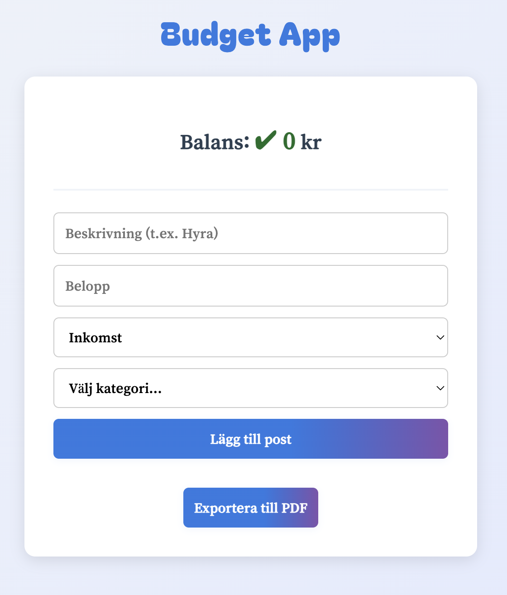
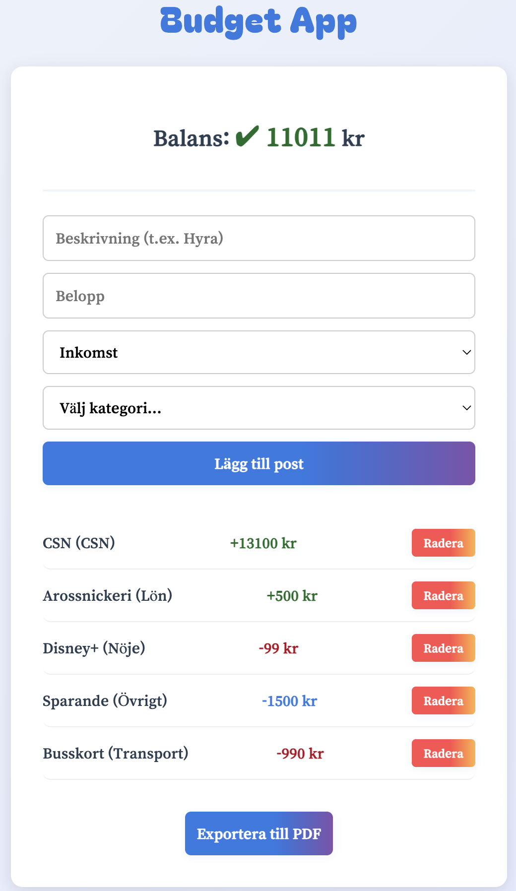
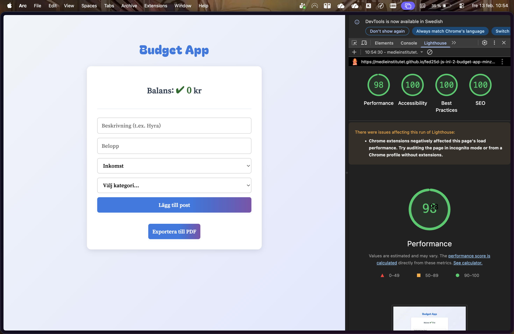
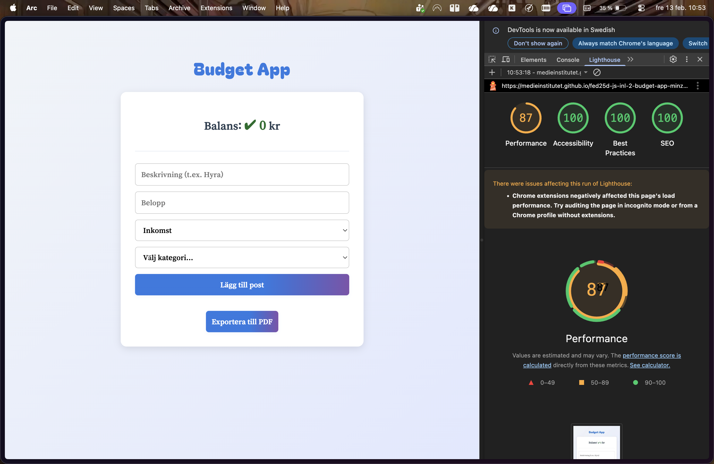
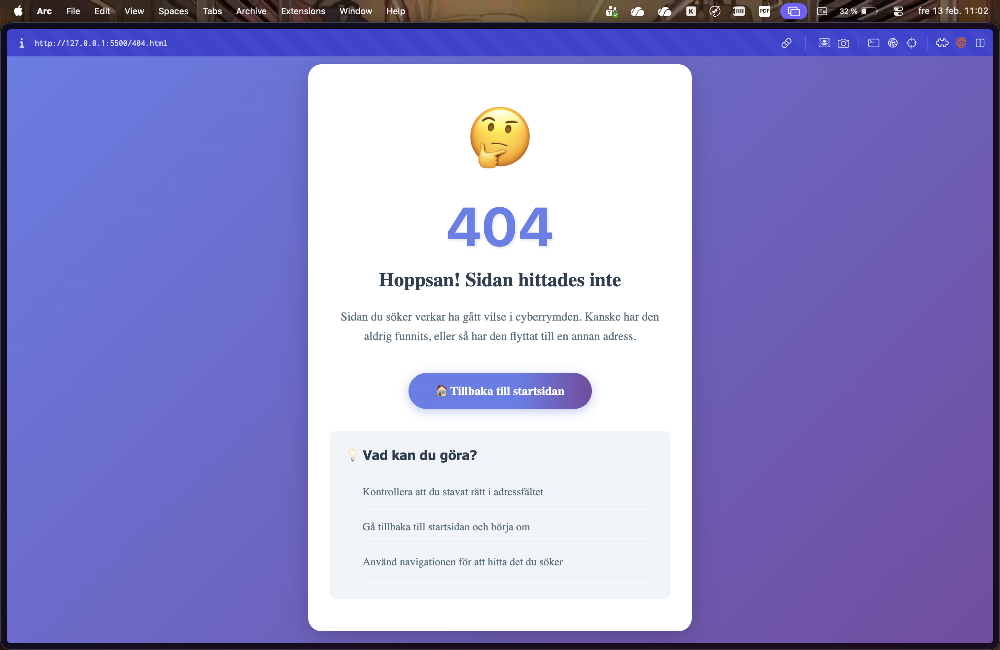
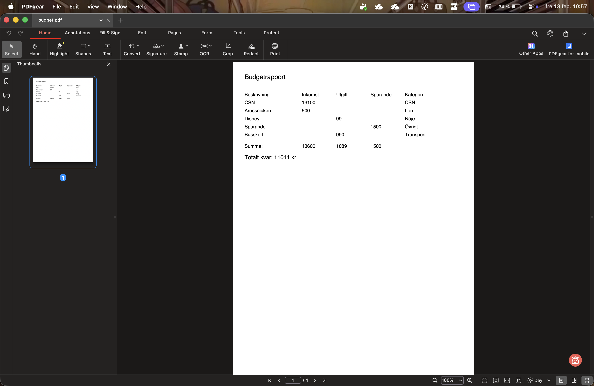

# Budget App 🐷 – Ta kontroll över din ekonomi

En modern, snabb och tillgänglig webbapplikation för att hantera din vardagsekonomi. Appen låter dig logga inkomster, utgifter och sparande, samt exportera dina data till en professionell PDF-rapport.




## 🚀 Funktioner

- **Transaktionshantering:** Lägg till och radera inkomster, utgifter och sparande.
- **Realtidsbalans:** Din totala balans uppdateras omedelbart och färgkodas (grön för plus, röd för minus).
- **Dynamisk PDF-export:** Skapa en snyggt formaterad rapport av din budget med ett klick.
- **Smart Lagring:** All data sparas i webbläsarens `localStorage` – dina poster finns kvar även om du stänger webbläsaren.
- **Hög Tillgänglighet (A11y):** Fullt stöd för skärmläsare och tangentbordsnavigation.
- **Responsiv Design:** Optimerad för både mobila enheter och desktop med modern CSS (`clamp`, Flexbox).
- **Anpassad 404-sida:** En lekfull och informativ felsida om du hamnar på fel URL.

## 📸 Skärmdumpar

### Överblick & Inmatning

Lighthouse Desktop


Lighthouse Mobile


404-sida



### PDF-Rapport



## 🛠 Teknisk Stack

- **Språk:** [TypeScript](https://www.typescriptlang.org/) för typsäker och robust kod.
- **Verktyg:** [Vite](https://vitejs.dev/) för blixtsnabb utveckling och bundling.
- **Kodstandard:** [Biome](https://biomejs.dev/) för snabb linting och formatering.
- **Bibliotek:** [jsPDF](https://github.com/parallax/jsPDF) för generering av rapporter.
- **Design:** Custom CSS med fokus på tillgänglighet och modern typografi.

## ⚙️ Installation & Körning

1.  **Klona repot:**
    ```bash
    git clone [https://github.com/Medieinstitutet/fed25d-js-inl-2-budget-app-minza-42.git](https://github.com/Medieinstitutet/fed25d-js-inl-2-budget-app-minza-42.git)
    ```
2.  **Installera beroenden:**
    ```bash
    npm install
    ```
3.  **Starta utvecklingsservern:**
    ```bash
    npm run dev
    ```
4.  **Bygg för produktion:**
    ```bash
    npm run build
    ```

**Utvecklad av:** [minza-42](https://github.com/minza-42) (FED25D)
